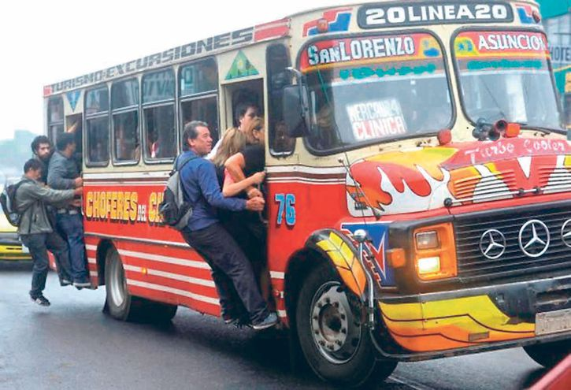

# Bondi-en-Pandemia---Programación Concurrente

Dado el contexto de pandemia, en los colectivos, o "BONDIS" solo se permiten viajar hasta un maximo determinado por el Ministerio de Salud, si se alcanza esa capacidad, no puede subir mas nadie hasta que no se haya bajado al menos una persona.
Realizado entonces, el planteo, utilizar concurrencia para resolver el problema.

